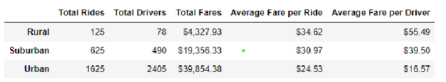

# PyBer_Analysis

## PyBer Analysis Overview
Omar and I have been asked by V. Isualize to use Python and Pandas, to create summary data based on the PyBer input .csv ride sharing tables that
were provided. The end output should be created using Pandas and Matplotlib to create a multiple-line graph that shows the total weekly fares
foreach city type: Urban, Suburban and Rural. This report should provide required summary output.

## PyBer Analysis Results:
There were 5 key metrics being calculated in doing the PyBer ridershare analysis.  Below are the details uncovered for each metric as shown in attached shot of the dataframe created with reesult of analysis:

### Total Rides by City Type - This metric, shows that as you go from Urban to Suburban to Rural, the number of rides decreases.  This would be expected, partly due to the population of those areas; Less people = less required rides.

### Total Drivers by City Type  - Similar to rides per city type, this metric as you go from Urban to Suburban to Rural, the number of drivers decreases.  This would be expected, again partly due to the population of those areas.

### Total Fares by City Type  - Total fares would be impacted by the above two factors, Total Rides per City Type and Total Drivers.

### Average Fare per Ride by City Type - this metric indicates that as the area of driving increases, so does the fare.  Therefore, you would expect the average fare to be higher as the distances of the rides becomes further.

### Average Fare per Driver by City Type - same as above metric, Average Fare per Ride, this metric would increase as the distances increase as you go from Urban all the way to Rural.

## PyBer Analysis Summary
If we look at the metrics in the above output and the below data graph

- As expected, and noted above, as we go from a very populate urban area in a smaller space compared to a less populated suburban area, again compared to the area of land, and then finally to the rural area, which would have the greatest amount of land expanse to traverse as a driver to get from point A to point B, the fare per ride and driver would increase.
- While it may look unevenly 
- The above is somewhat to be expected, once you see the graph and ouput. But to really get to the bottom of the data, there are a few more data ponts that would need to be investigated:

1) There needs to be a closer look at the ratio of drivers to type of city and daily total fares per driver per city type.  
2) There must be drivers who traverse one or two or even all of the types: rural, suburban and urban.  Which group did those folks put themselves in and how much of am impact does it have on there rates?
3) Length of time per ride; We should take a look at the length of time per ride and the impact on the overall data, especially the Avererage Fare per Ride and Driver.  There may not be enough time for those drivers to have more rides.
4) Once a closer look at these additional metrics have been completed it can be determined if we need more or less drivers in each city type and perhaps other additonal metrics will be revieled. 

## Resources
- Data Source: city_data.csv 
	       ride_data.csv
- Software: Matplotlib, Scipy, Pandas and Nympy.

# Challenge Overview
There were definitely parts of the challenge that were not clear which resulted in me wasting time on irrelevent points. Otherwise, it was a fun challenge - like a puzzle you are both creating and solving at the same time.
